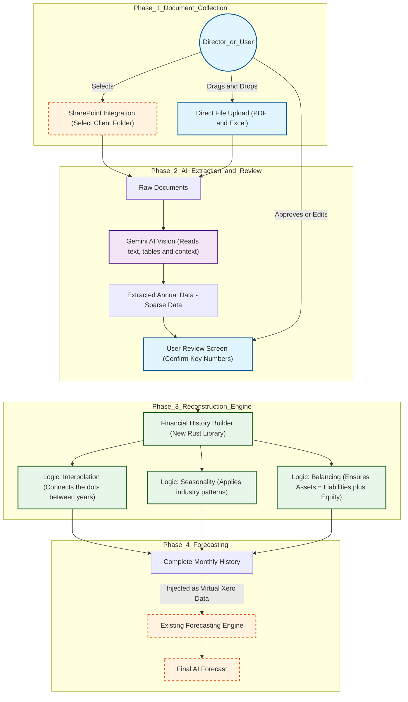

Here is the high-level architectural plan designed for the Company Directors. It focuses on the workflow, the value add, and how we bridge the gap between static PDF documents and our dynamic forecasting engine.

### Executive Summary

We are extending the **Xero AI Forecaster** to support clients who do not use Xero. By leveraging Google’s Gemini AI for document understanding and a new custom-built mathematical engine, we can ingest static financial documents (PDFs, Excel, Scans) from SharePoint or direct upload.

This system "reads" annual reports, uses AI to understand the context, and mathematically reconstructs a detailed, balanced 3-year monthly history. Once reconstructed, this data feeds seamlessly into our existing forecasting tools, allowing us to offer our full suite of advisory services to **any client, regardless of their accounting software.**

---

### System Architecture Diagram

---

### Detailed Workflow Explanation

#### 1. Document Ingestion (The Input)
We are removing the barrier to entry. Users will have two simple ways to get client data into the system:
*   **Direct Upload:** Simply drag and drop annual reports, tax returns, or Excel trial balances directly into the app.
*   **SharePoint Sync (New):** We will integrate directly with the company SharePoint. You can select a client folder, and the system will automatically pull the relevant financial documents (PDFs of annual reports, etc.) for processing.

#### 2. AI "Reading" & Extraction (The Eyes)
We utilize **Google Gemini's Document Understanding** capabilities. Unlike older systems that just look for text, Gemini "sees" the document. It understands the difference between a Balance Sheet table and a Profit & Loss table, handles footnotes, and ignores irrelevant marketing fluff in annual reports.
*   **What it does:** It extracts the high-level numbers (e.g., "2023 Revenue: $1.2M", "2024 Revenue: $1.5M").
*   **Why it's better:** It is highly tolerant of different layouts. We don't need templates for every different client format.

#### 3. The User Review Step (The Trust Layer)
AI is powerful but can make mistakes. Before we do any math, we present the extracted "Annual Summaries" to the user in a simple grid.
*   **Action:** The user confirms the numbers match the document.
*   **Benefit:** This ensures the foundation of our forecast is 100% accurate before we start modeling.

#### 4. The Reconstruction Engine (The "Financial History Builder")
This is the new core technology we are building. The AI gives us "dots" (annual totals), but our forecasting engine needs a "line" (monthly data). This library mathematically draws the lines between the dots.

*   **Smart Interpolation:** It doesn't just draw straight lines. If the AI knows the client is a "Retail Business," the engine applies a seasonal curve (higher sales in December) while ensuring the total still adds up exactly to the annual report.
*   **Realistic Variance:** Real financial data isn't perfectly smooth. The engine adds controlled "noise" (random slight variations) so the data looks organic and realistic, not synthetic.
*   **Accounting Integrity:** This is critical. The engine creates a "self-healing" Balance Sheet. It calculates Assets and Liabilities and automatically adjusts Equity to ensure the fundamental accounting equation ($Assets = Liabilities + Equity$) always holds true. This prevents the forecast engine from crashing due to unbalanced data.

#### 5. Forecasting (The Output)
Once the **Reconstruction Engine** finishes, it outputs a detailed, 3-year monthly history that looks *technically identical* to data we usually get from Xero.
*   **Seamless Integration:** We inject this data into our existing **Xero AI Forecaster**.
*   **Full Capabilities:** You can now use all the existing features—AI chat, scenario planning, charts, and report generation—on this client, exactly as if they were connected to Xero.

### Strategic Recommendation

**Proceed Immediately.**
This architecture maximizes the reuse of our existing investment. By building the **Financial History Builder** as a standalone "translator," we keep our main forecasting engine pure and unmodified. We are essentially tricking our own system into thinking it's talking to Xero, which is the fastest, safest, and most cost-effective way to launch this feature.